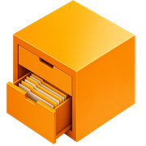
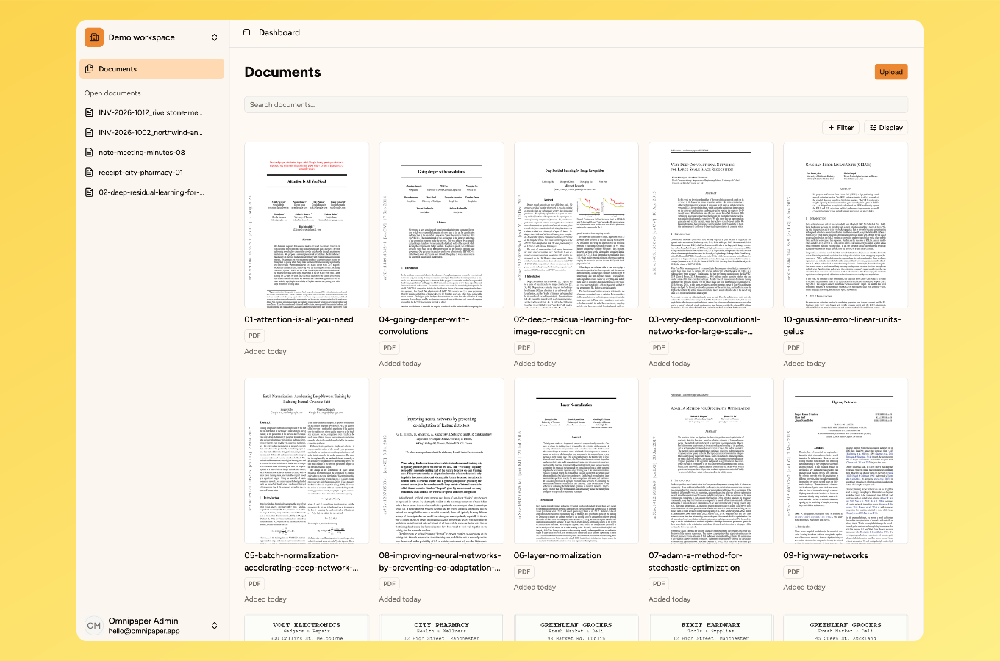

> **Pre-alpha** — under active development. Expect breaking changes between releases.

# omnipaper

**A modern document manager that's actually pleasant to self-host.**

[`website`](https://omnipaper.app) &nbsp; [`demo`](https://demo.omnipaper.app) &nbsp; [`docs`](https://docs.omnipaper.app) &nbsp; [`github`](https://github.com/omnipaper/omnipaper)

 

---

## What it is

omnipaper is a modern, opinionated document management system. It's a UX-first alternative to paperless-ngx, built for families and your own cloud storage. Upload a file, and it gets organized, searchable, and easy to find again.

Where paperless-ngx is capable but dense, omnipaper bets on a clean, responsive UI that works on a phone as well as a desktop

## Screenshot

Try it live at **[demo.omnipaper.app](https://demo.omnipaper.app)**.

## Highlights

- **Cloud-storage first** — your documents live in your own S3-compatible bucket (AWS S3, Cloudflare R2, MinIO), never on local disk. Backups and versioning stay your provider's job.
- **Minimal setup** — strong defaults instead of endless knobs. Storage, OCR, and providers are configured in the UI, not in config files.
- **Built for families and teams** — multi-organization workspaces with roles and invitations, so everyone shares one archive.
- **Search everything** — optional OCR plus full-text search across your documents.
- **UX-first** — a clean, responsive interface designed for the browser and the phone from day one.
- **Dead-simple self-host** — a single Docker image plus PostgreSQL. No Redis, no extra services.

See the **[docs](https://docs.omnipaper.app)** for the full, current feature list.

## Self-hosting

omnipaper runs as a single Docker image alongside a PostgreSQL database and an S3-compatible bucket. A handful of environment variables get you booted; everything else is configured in the UI after you create the first account.

Full setup, environment reference, and a Docker Compose example are in the **[Installation docs](https://docs.omnipaper.app)**.

## Status

Pre-alpha, under active development. Expect breaking changes between releases. The web app is the only client.

## Contributing

Issues, ideas, and pull requests are welcome Open one on [GitHub](https://github.com/omnipaper/omnipaper)

## License

omnipaper is **open source** and distributed under the **Sustainable Use License**.

- **Open source** — read, modify, and run the full source.
- **Free to self-host** — for yourself, your family, or internally within your company.